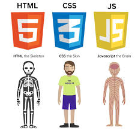

# Amigo-Secreto
## Challenge-amigo-secreto

### Projeto criado para treinamento das tecnologias: Html/Css/JScrypt.

### Primeiro Clique no botão sortear e digite o nome de um de seus amigos.
##  Clique no botão sortear 
### e o sistema sorteará um nome para você
### Caso digite uma quantidade de nomes inferior a dois o sistema enviará um alert
### para avisar que necessita de no mínimo dois nomes para o sorteio.
## Assim podemos aprender a utilizar:
### Variáveis
### Estruturas de Decisão
### Funções 
### Listas.
